# <조삼모사> - <KNU통학 셔틀버스 운행정보 관리 및 예정시간 알림 시스템>
Server Repository : https://github.com/KNUShuttleOPS/knu-shuttle-bus-server
## 서비스 요약
KNU통학 셔틀버스 운행정보 관리 및 도착 예정시간 알림 시스템 - 실시간 학교 셔틀버스 운행 정보 알림 시스템

## 주제 구분
-	E타입 경북대에 다니는 다양한 배경의 학우들을 위한 서비스

## 팀원 소개
조삼모사
팀장: 류나은/컴퓨터학부/2020116167
팀원: 송정헌/컴퓨터학부/2018113300
서정호/융복합시스템공학부/2018114859
남궁근/전자공학부/2019110484

## 시연 영상
Youtube Link : https://youtu.be/FwFFSWIxgn8

## 서비스 소개
실시간 학교 셔틀버스 운행 정보 알림 시스템
### 서비스 개요
학교 셔틀버스 기사님께서 어플리케이션을 통해 운행 시작을 알리면 실시간으로 셔틀버스 위치와 정류장 도착 예상 시간이 학생들에게 전달될 수 있도록 해주는 서비스이다. 사용자는 이를 통해 보다 더 정확한 시간에 알맞게 정류장에 가 버스 승차 대기를 할 수 있게 된다.

### 타서비스와의 차별점
Knupia나 학교 홈페이지에 들어가면 셔틀 버스 정류장 위치와 버스 시간표를 확인할 수 있다. 그러나 출근시간 셔틀버스가 운행하는 경우가 많고 이에 따라 실시간 교통상황에 따른 오차를 반영하지 못하는 경우가 종종 발생한다. 이를 개선하고자 카카오맵이나 다른 버스 정보 시스템과 같이 실시간 교통정보와 버스 위치를 반영하여 각 정류장에서의 셔틀버스 도착 시간을 사용자에게 알려주고 지연, 사고 등 변수 등이 발생할 시 사용자에게 알림이 갈 수 있도록 하는 서비스를 구현해보았다.

### 구현 내용 및 결과물

1. 실시간 도착정보 시스템
  - 실제 버스도착정보 서비스와 비슷하게 노선도 위에 버스가 놓여져 있도록 하는 UI를 활용하여 버스 위치와 도착시간을 확인할 수 있도록 하였다.
  - 실시간 교통정보 또는 기사님의 알림서비스를 이용하여 위치에 따른 버스 도착 정보만이 아닌 지연 예상 시간까지 나타낸다.

 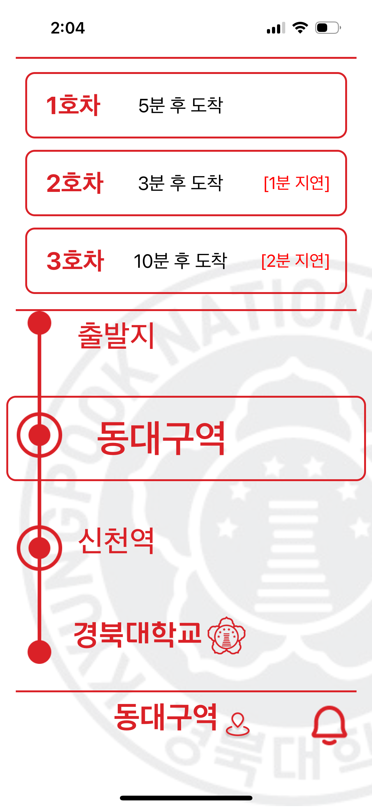

  - 원하는 정류장의 버스의 도착 5분전 사용자에게 알림이 가 사용자가 버스 시간에 맞게 이동할 수 있다.

2. 학생들과 기사님간 로그인 창 분리
  - 아래와 같이 학생로그인과 기사로그인 창을 분리하였다.
  
  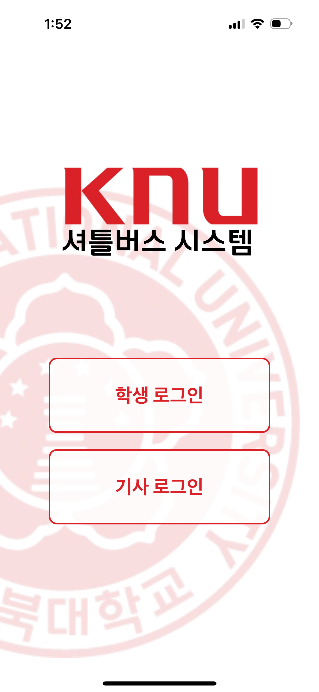 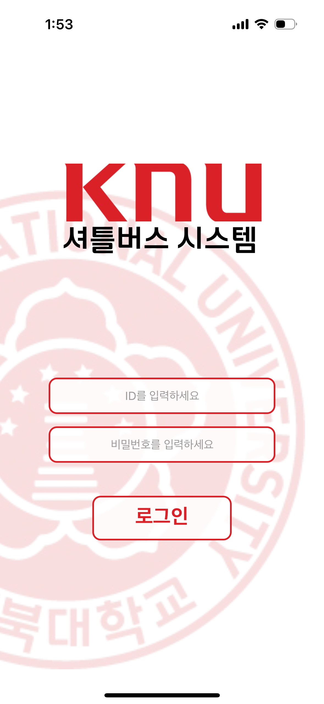

  - 학생 로그인을 하게되면 노선도를 통해 실시간 버스 도착 정보와 지연 알림 확인 할 수 있다.
  - 원하는 노선을 즐겨찾기하여 실시간 알림을 받아볼 수 있다.
  
 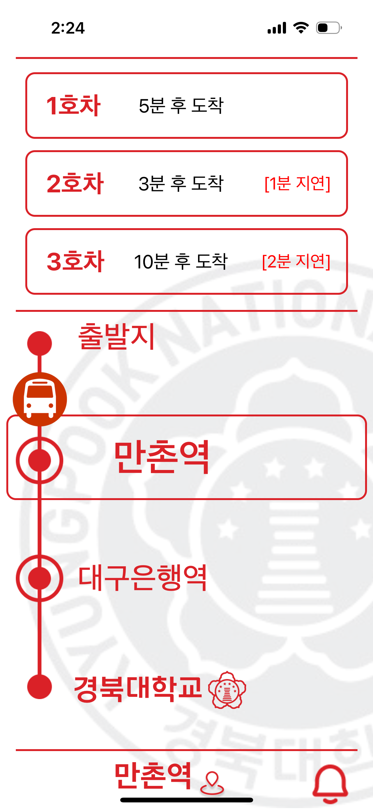 

  - 지도를 통해 정류장과 버스의 실시간 위치를 확인할 수 있다.

  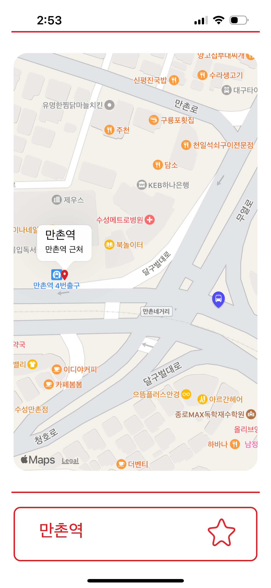 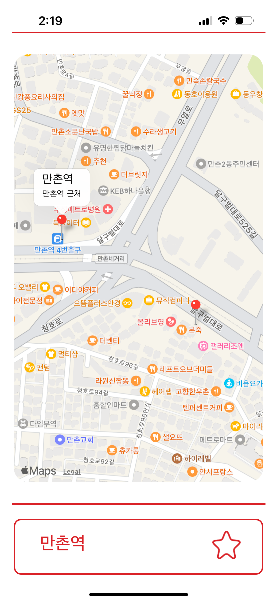
  
  - 기사 로그인을 하게되면 회차별 운행 시작 및 종료 등 비교적 간단한 UI를 이용하여 이용 편의성을 높였다.

  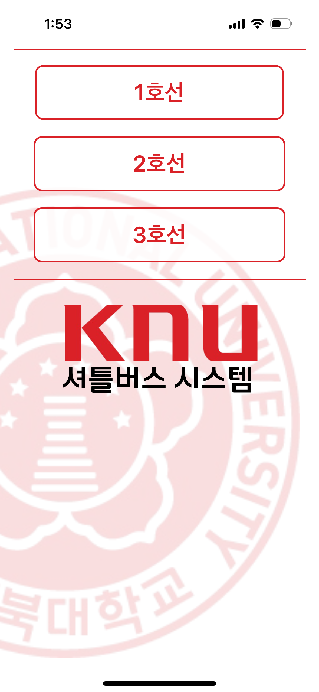 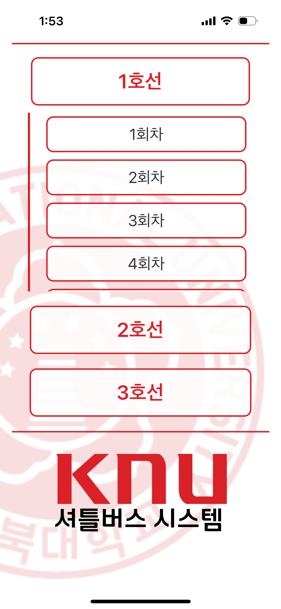 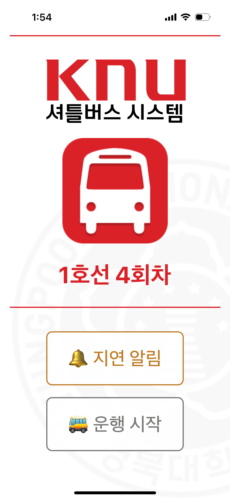 
  
  
3. 부가 서비스 활용
  - 실시간 정보 외에 시간표, 불편사항 접수 등 부가서비스를 활용할 수 있다.

 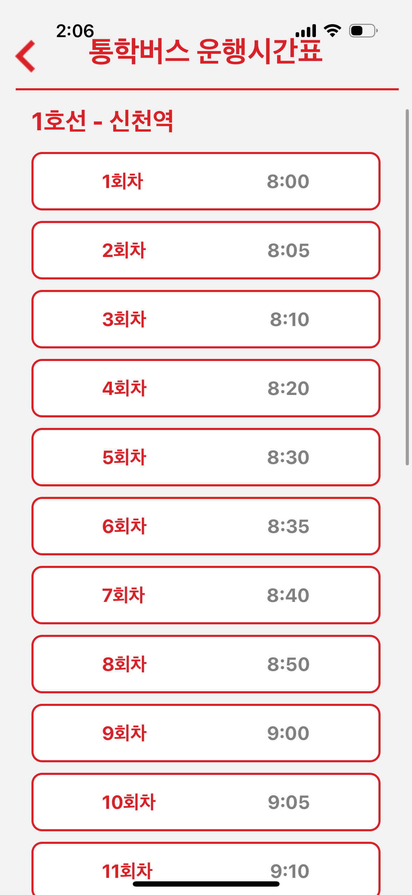 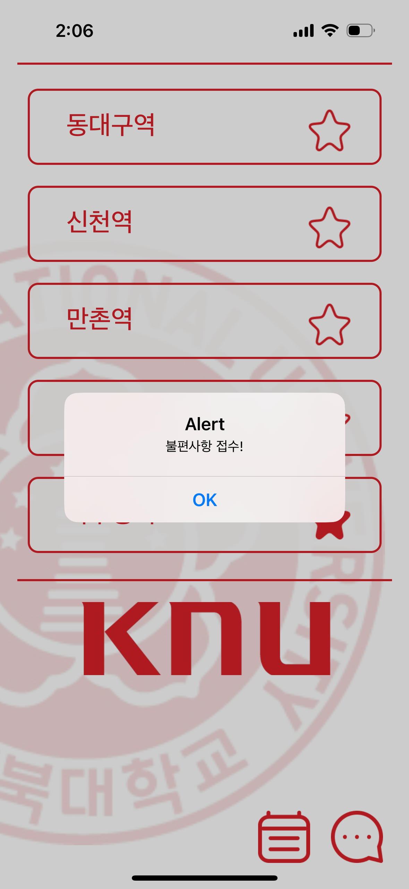

## ERD
  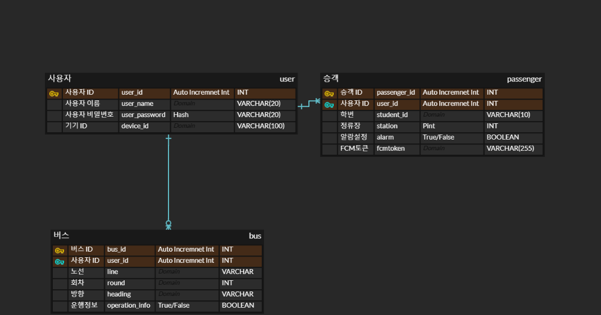
## 구현 방식
  FE : React Native
  BE : Java, Spring
  + Docker
## 향후 개선 혹은 발전 방안
셔틀버스 운행과 지연에 관한 데이터를 수집하여 버스 시간 간격 조정 및 정류장 위치 개선 등 효율적인 서비스 제공에 바탕이 될 것이다. 이러한 서비스 제공은 학생들의 편의뿐만 아니라 버스 운행 자체의 최적화에 기여하여 운영비용 절감 및 배기가스 저감에 기여할 것이다.
